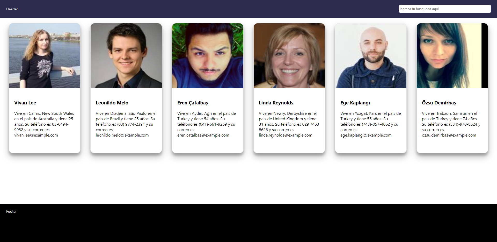

### App Random Persons

Ahora debemos completar el ejercicio que realizamos en la sesión anterior haciendo uso de las peticiones de datos.



### 1. Setup

Para este challenge debes realizar una copia de la aplicación App Random Persons.

### 2. Guía

La información que necesitas para mostrar las cartas de las personas ahora la obtendrás directamente de `https://randomuser.me/` (puedes leer la documentación [aquí](https://randomuser.me/documentation)) haciendo uso del hook `useEffect` y debes almacenarla usando el hook `useState`.

La idea es tener un código parecido al siguiente:

```
const [personas, setPersonas] = useState([]);

useEffect(() => {
    fetch('https://randomuser.me/api/?results=6')
        .then(response => response.json())
        .then((response) => {
            setPersonas(response.data.results);
        })
}, [])

```

Pero recuerda que `fetch` hace llamadas asíncronas, así que debes usar `async/await` para esperar a este pedido de datos.
Además, ahora es necesario que la barra de búsqueda del Navbar funcione de manera que al escribir un nombre o apellido se filtren solo los resultados pertinentes. Para esto deberás hacer uso de `useState`, `useEffect` y `props` para comunicar a los diferentes componentes con la lógica necesaria para cumplir este objetivo.
PD: Recuerda que la petición inicial de datos no debe cambiar, solo debes filtrar las personas que se recibieron en un primer momento.

### Solución

No hagas trampa! Trata de hacer lo máximo posible **por ti mismo** antes de ver el repositorio de la solución.

<details><summary>View solution</summary><p>

👉 Aquí el [repositorio de la solución](...).

</p></details>
