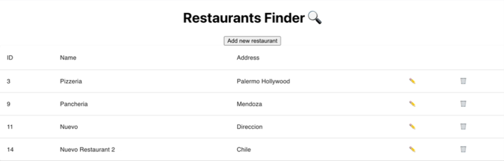

¡No hay tests para esta challenge, crearemos una App!

# Restaurants Finder - Admin Page

¡Es hora de poner en uso todos los controllers y endpoints que creamos en la sesión de Rails!

Crearemos una tabla CRUD (Create-Read-Update-Delete) interactiva en React para manejar la lista de restaurantes que tenemos almacenada en nuestra base de datos. Para lograrlo, haremos consultas a los endpoints de nuestro servidor en Rails a través de los métodos HTTP: GET, POST, PATCH, DELETE.



#### 1. Setup

Para este challenge debemos crear un proyecto nuevo en React usando el comando:

```
npx create-react-app restaurants-react
```

Luego, debes crear una carpeta `components/` dentro de la carpeta `src/`. Allí colocaremos todos los componentes que iremos creando durante el challenge.
Además, crearemos un archivo `.env` a la altura del proyecto que contendrá variables de entorno que usaremos en la aplicación.
Ambas tareas se realizan con los siguientes comandos:

```
cd restaurants-react
cd src
mkdir components
cd ..
touch .env
```

Dentro del archivo `.env` debes colocar lo siguiente:

```
REACT_APP_API_URL = http://localhost:3000/api/v1/restaurants
REACT_APP_USER_EMAIL = *PUT EMAIL HERE*
REACT_APP_USER_TOKEN = *PUT TOKEN HERE*
```

El email y el token son los generados en la sesión de Rails. Solo debes reemplazar donde lo indica.

Por último, para terminar el Setup, instalaremos la librería de [Material UI](https://mui.com/) y otras librerías que nos ayudarán con los estilos de las tablas y modales, usando el siguiente comando:

```
yarn add @mui/material @emotion/react @emotion/styled
```

No olvides colocar la siguiente configuración de CORS dentro del archivo `config/application.rb` para poder aceptar todas las consultas externas en nuestro servidor de Rails:

```
config.middleware.inser_before ActionDispatch::Static, Rack::Cors do
    allow do
        origins '*'
        resource '*', :headers => :any, :methods => [:get, :post, :options, :patch, :delete]
    end
end
```

Finalmente, correremos el servidor de Rails con `rails s` que dispondrá del puerto 3000 para escuchar las peticiones y el servidor de React con el comando `npm start` que abrirá una página en el puerto `http://localhost:3001`!
**Nota: Ya que nuestro servidor de Rails usa el puerto 3000 y React por defecto también, éste último te lo advertirá y luego te ofrecerá correr en otro puerto, por lo que terminará corriendo en el puerto 3001**

#### 2. Guía y Features

1. Debes crear un componente `Restaurants` que guarde la información de restaurantes que recibe del servidor de Rails. Recuerda usar `useEffect` y `useState` en conjunto para lograrlo. Como recomendación adicional, es mejor abstraer la lógica de petición de datos en una función que llamarás dentro del hook `useEffect`, ya que esta función se pasará como props a varios componentes de la aplicación para ser usada cada vez que se necesite hacer _refresh_.
2. Luego usarás los componentes de Material UI para crear la tabla, puedes seguir esta estructura que tiene como columnas ID, Name y Address:

   ```
   <TableContainer component={Paper}>
       <Table sx={{ minWidth: 650 }} aria-label="simple table">
           <TableHead>
               <TableRow>
                   <TableCell>ID</TableCell>
                   <TableCell>Name</TableCell>
                   <TableCell>Address</TableCell>
               </TableRow>
           </TableHead>

           <TableBody>
               {/* DENTRO DE CADA TABLE ROW IRAN LOS RESTAURANTES */}
               <TableRow
               key={item.name}
               sx={{ '&:last-child td, &:last-child th': { border: 0 } }}
               >
                   <TableCell></TableCell>
                   <TableCell></TableCell>
                   <TableCell></TableCell>
               </TableRow>
           </TableBody>
       </Table>
   </TableContainer>

   ```

3. Debes mostrar los restaurantes que obtienes de la petición de datos, iterando sobre ellos y para cada uno crear un `<TableRow></TableRow>` como el del ejemplo. Recuerda colocar cada dato pertinente en cada columna usando la interpolación `{ }`. ¡No olvides el atributo key!.
4. Ahora que tenemos la tabla lista, crearemos las funcionalidades de

   - **Agregar restaurantes**: Para este task crearás un botón (en el lugar que prefieras dentro de la aplicación, recomendamos sea arriba de la tabla pero debajo del título) que abrirá un modal que se encontrará en otro componente llamado `Create.js`.
     Dentro de este nuevo componente colocarás el [modal de ejemplo](https://mui.com/components/modal/#basic-modal) agregando una variable externa a la función de estilos:

     ```
     const style = {
        position: 'absolute',
        top: '50%',
        left: '50%',
        transform: 'translate(-50%, -50%)',
        width: 400,
        bgcolor: 'background.paper',
        border: '2px solid #000',
        boxShadow: 24,
        p: 4,
     };
     ```

     Que será adicionada al componente `<Box></Box>` de Material UI como se ve en el ejemplo.
     Este componente `Create` recibirá como props el estado boolean que le indica que se abra, la función que modifica ese estado y la función de _refresh_ de la que hablamos anteriormente.

     Dentro del modal debes crear inputs a modo de formulario que manejen la información necesaria para crear un nuevo restaurante (Name y Address). Puedes usar el componente [`<TextField />`](https://mui.com/components/text-fields/#form-props) de Material UI. ¡No olvides enlazar el componente y los estados usando los atributos `value` y `onChange`!

     Debes crear una función `handleSubmit()` y enlazarla a un botón que se encargue de mandar los datos del nuevo restaurante hacia tu servidor de Rails con las siguientes options:

     ```
     let requestOptions = {
            method: 'POST',
            redirect: 'follow',
            headers: {
                "Content-Type": "application/json",
                'X-User-Email': process.env.REACT_APP_USER_EMAIL,
                'X-User-Token': process.env.REACT_APP_USER_TOKEN
            },
            body: JSON.stringify({
                    name,
                    address
                })
        };
     ```

     Y posteriormente, ejecutar el _refresh_ y cambiar el estado booleano que muestra el modal a `false`.

   - **Editar restaurantes**: Similar al anterior task, debes crear un nuevo componente `Edit.js` que contenga un `<Modal></Modal>` de Material UI, pero esta vez el botón de editar debes colocarlo en cada fila de restaurante. Puedes usar el ícono ✏️ o algún ícono de alguna librería que desees (FontAwesome, MaterialIcons, Flaticon, etc.). La lógica se mantiene igual, la diferencia se dará a la hora de hacer la solicitud, para el que usaremos las siguientes opciones:

     ```
         let requestOptions = {
             method: 'PATCH',
             redirect: 'follow',
             headers: {
                 "Content-Type": "application/json",
                 'X-User-Email': process.env.REACT_APP_USER_EMAIL,
                 'X-User-Token': process.env.REACT_APP_USER_TOKEN
             },
             body: JSON.stringify({
                     name,
                     address
                 })
         };
     ```

     Recuerda que el id del restaurante es el que determinará qué restaurante se editará, por lo que debes construir el url de consulta para lograrlo.

     De igual manera, al final la función ejecutar el _refresh_ y cambiar el estado booleano que muestra el modal a `false`.

   - **Eliminar restaurantes**: Para este task no crearemos un modal, sino que solo realizaremos una solicitud directa. Deberás adicionar una columna más a la tabla y agregarle un botón a cada fila con algún ícono que represente la acción de borrar/eliminar como por ejemplo 🗑. A este botón enlazar la acción de enviar una solicitud con las siguientes opciones:

     ```
     let requestOptions = {
                 method: 'DELETE',
                 headers: {
                     "Content-Type": "application/json",
                     'X-User-Email': process.env.REACT_APP_USER_EMAIL,
                     'X-User-Token': process.env.REACT_APP_USER_TOKEN
                 },
                 redirect: 'follow'
             };
     ```

     Recuerda que el id del restaurante es el que determinará qué restaurante se eliminará, por lo que debes construir el url de consulta para lograrlo.

¡Y listo! Tenemos una aplicación de manejo administrativo de restaurantes lista para ser usada 😉

### Solución

¡No hagas trampa! Trata de hacer lo máximo posible **por ti mismo** antes de ver el repositorio de la solución.

<details><summary>View solution</summary><p>

👉 Here's [a live example](https://lewagon.github.io/react-giphy/) of the [solution repository](https://github.com/lewagon/react-giphy).

</p></details>
